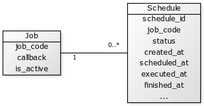

## Basics

A *job* is the definition of *what* needs to be done. Consider this the "blueprint" of a task. A *schedule* instead is the concrete instance of *when* this specific job will be executed or was executed with some specific information of that execution.

### Job

"Blueprint"

- callback
- XML file vs. database
- Always vs. default task
- Schedule defined on job or referring to configuration

#### Job fields

What's new compared to native jobs?
- new fields/features
	- name, description,... (https://github.com/AOEpeople/Aoe_Scheduler/issues/46)
	- groups
	- parameters
	- disable

### Schedule

"Instance"
"individual run"
Schedule always refers to a job
Identified by time
Has a status

[Job|job_code;callback;is_active]1-0..*[Schedule|schedule_id;job_code;status;created_at;scheduled_at;executed_at;finished_at;...]

scheduled_by
scheduled_reason

### How does scheduling work?

- Generate schedules
- Schedule ahead
- Detect duplicates

#### Job types

- xml
- db
- db_xml

crontab vs default/crontab
xml files vs database
- Explain how db is stored (native magento way)

Explain priorities (what's overlaying what?)

Specifically explain 'Cron configuration path' vs 'Cron expression' since a xml jobs 'cron expression' could be overwritten by an db overlay but at the same time there's a cron configuration path setting on the original or in the overlay record. Who wins?

- cron_configuration_path wins over cron_expr
- db_xml wins over xml

if db_xml's cron_configuration_path and the xml' cron_confiruation_path isn't then the latter one wins even is the db_xml has a cron_expression

Explain how empty field doesn't mean that this is a fallback, but that the field is actually empty. If the overlay field equals to the xml field than this will not be persistet (=fallback)
