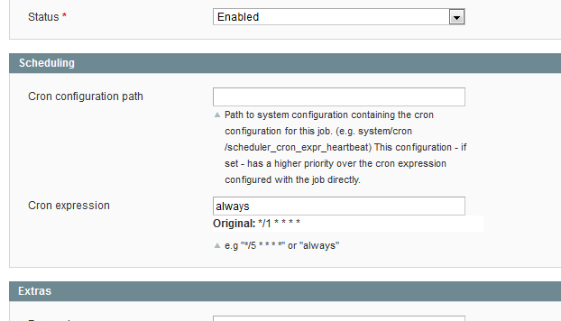
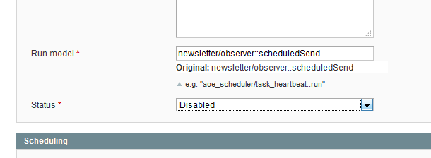

## Declutter your timeline view and optimize cron processing

### Replace high frequency schedules with 'always'

Some jobs come with a high frequency schedule like `* * * * *` (or strange enough some write it as `*/1 * * * *`). Even running a job every 5 minutes (`*/5 * * * *`) can be considered a  high frequency.

Depending on your cron configuration cron might not be even called that often which results on these schedules piling up. Luckily Aoe_Scheduler takes care of this (Mage_Cron doesn't!) and skips overlapping schedules while keeping and executing only a single one. 

But really what you these high frequency configuration are expressing is 'run me as often as possible' and this is exactly what the special cron expression 'always' was introduced for.

A good candidate for this change is **core_email_queue_send_all**. Go to 'System > Scheduler > Job Configuration' and click on the core_email_queue_send_all row. Then go to the 'Cron expression' field and replace the value with 'always'.

### Disable unused jobs

Another candidate for this would be **newsletter_send_all**, but since you might not be sending newsletters from within Magento anyways you might want to disable this job completely:

### Only keep 20 schedules

Ideally everything works fine and you'll see only green bars in the timeline view. If you have too many jobs and decided to keep every schedule for a day or longer ("Success History Lifetime") your timeline view might take a while to load.

Instead of cutting down the "Success History Lifetime" you can configure the "Maximum number of successful schedules to keep" value to 20 or so. This way only the last 20 successful schedules will be kept and the others will be cleaned up. Failed, skipped and missed (the red ones) schedules will stick around according to your "Failure History Lifetime" setting.

