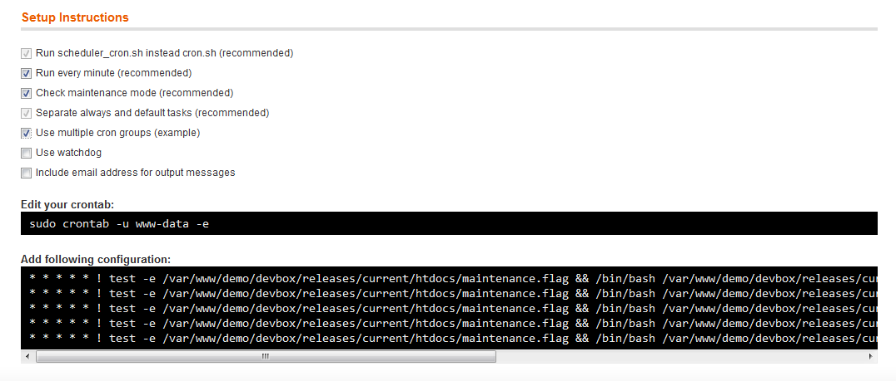

## Instructions

Find the instructions interface in `System > Scheduler > Instructions`

This provides an interactive interface helping you to create the cron configuration based on your current Magento installation and other preferences.

Find more information on how to setup cron [here](doc/cron-configuration.md).

