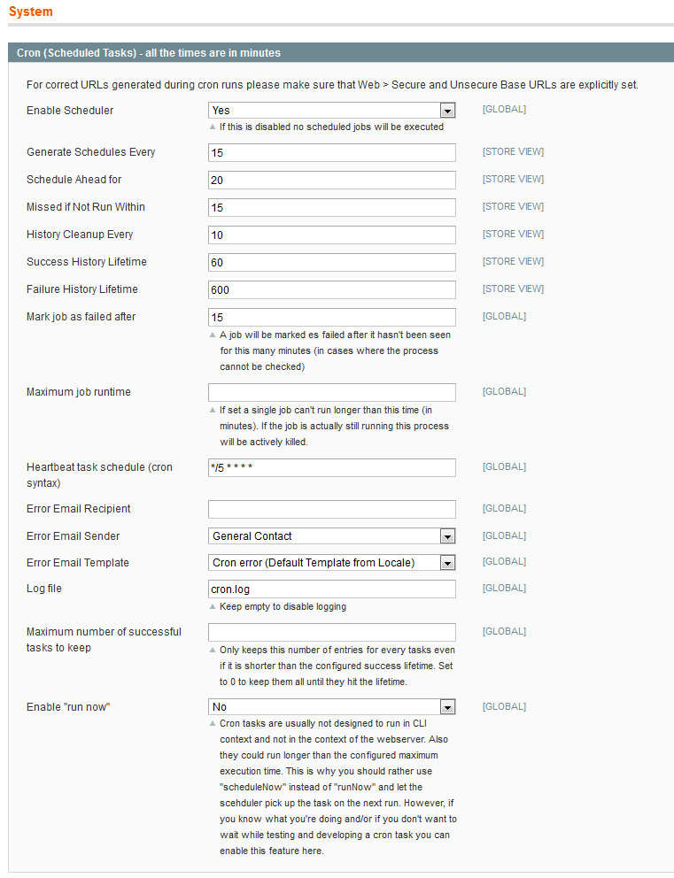

## System Configuration

Find the configuration in `System > Configuration > System > Cron (Scheduled Tasks)

### Configuration Options

TODO: Walk through all configuration parameters here and advice what settings to use

