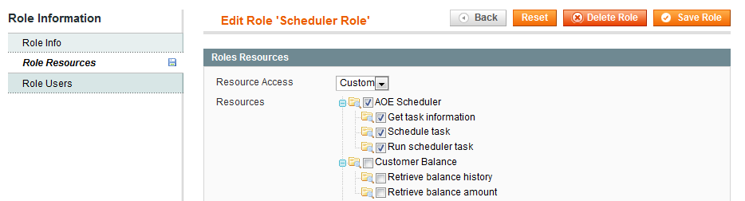

## Web Services

### Usage example

1. Create a web service **user role**:
Go to `System > Web Services -> Roles -> Role Resources` and set "Resource Access" to "all" or to "Custom" and select the specific options you want to grant to your web services user:


2. Create a web service user and assign him to the previously created role (`System > Web Services > Users`)

3. Now you can access some scheduler functions (more might follow soon) via web service api. Currently only API v1 is implemented.


```php
<?php

$client = new SoapClient('http://yourhost/api/?wsdl');
$session = $client->login('your_username', 'your_api_key');

// Run a scheduler task 
$result = $client->call($session, 'aoe_scheduler.runNow', array('aoecachecleaner'));
var_dump($result);
    /*
    array(7) {
      ["job_code"]=>
      string(15) "aoecachecleaner"
      ["status"]=>
      string(7) "success"
      ["created_at"]=>
      string(19) "2011-11-15 20:55:41"
      ["scheduled_at"]=>
      string(19) "2011-11-15 20:55:41"
      ["executed_at"]=>
      string(19) "2011-11-15 20:55:41"
      ["finished_at"]=>
      string(19) "2011-11-15 20:55:41"
      ["schedule_id"]=>
      string(6) "150006"
    }
    */

// Schedule a task to run (from a normal scheduler process) as soon a possible ...
$result = $client->call($session, 'aoe_scheduler.schedule', array('aoecachecleaner'));
// ... or at a given time (e.g. in 1 hour):
// $result = $client->call($session, 'aoe_scheduler.schedule', array('aoecachecleaner', time()+60*60));
var_dump($result);
    /*
    array(5) {
      ["job_code"]=>
      string(15) "aoecachecleaner"
      ["status"]=>
      string(7) "pending"
      ["created_at"]=>
      string(19) "2011-11-15 21:06:07"
      ["scheduled_at"]=>
      string(19) "2011-11-15 21:06:07"
      ["schedule_id"]=>
      string(6) "150007"
    }
    */

// Get information on an existing task
$result = $client->call($session, 'aoe_scheduler.info', array('150007'));
var_dump($result);
    /*
    array(5) {
      ["job_code"]=>
      string(15) "aoecachecleaner"
      ["status"]=>
      string(7) "pending"
      ["created_at"]=>
      string(19) "2011-11-15 21:06:07"
      ["scheduled_at"]=>
      string(19) "2011-11-15 21:06:07"
      ["schedule_id"]=>
      string(6) "150007"
    }
    */
```