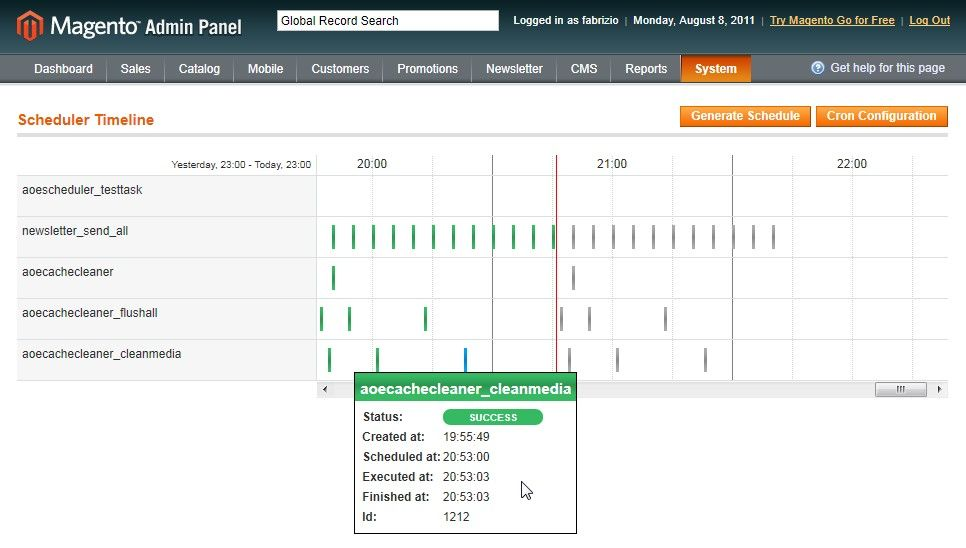

# AOE Scheduler for Magento

AOE Scheduler sits on top of Magento's default cron functionality allowing you to manage the jobs, to visualize the timeline and to get some deeper insight on what's going on behind the scenes and to shed some light on what might be going wrong. On top of that AOE Scheduler provides some more functionality like a cli and a web service interface, optimizing cron execution on your server and giving you everything you need to implement complex background tasks including for your Magento store.

## NOTE

This documentation is currently being written. Sadly, at this point it's still more an outline and some bullet points than a complete documentation. I'm working on it. If you have any comments feel free to [get in touch with me](https://twitter.com/fbrnc).

## Changelog

Version 1.0.0 is a major release. If you're updating from version 0.X please check out the changelog and verify everything is still working as expected after updating. 

[Changelog](changelog.md)

## Features

- **Timeline visualization**: The timeline view visualizes all past, current and future jobs showing their status, results, the runtime and some more details. 
- **Cron Management**: Find a list of all jobs defined in the Magento core or in any module installed. You can enable or disable individual jobs, modify them (e.g. edit their schedule) or even create new crons from scratch
- **Parameterized Crons**: Sometimes a simple cron run isn't enough. You might want to use the same cron but with different parameters. Example: Use this to create daily reports and weekly reports with the same job, but different input parameters.
- **Process Management**: Check if jobs are actually still running and kill them through Aoe_Scheduler if required.
- **Cron groups**: Split you crons into different groups so you can run them in parallel or distribute them on multiple servers.
- **Clean API**
	- **Cli**
	- **Web Service API**
	- **Developer API**: Create/run/schedule jobs programmatically. Use events to create workflows between jobs.
- **Instructions**: A new admin modules assists you in settings up your cron configuration.
- **Monitoring**: Heartbeat, Watchdog, last-seen, verification
- **Compatible with Magento's native cron scheduler**
- **Manuel scheduling and running**: Schedule or run your jobs manually or programmatically. This comes in handly during development or if you have actions that might have to be triggered manually at times (e.g. re-import product catalog, re-run statistics,...)

## Authors, contributors and maintainers

Author:
- [Fabrizio Branca](https://twitter.com/fbrnc)

Major Contributions:
- [Lee Saferite](https://twitter.com/leesaferite)
- For a full list of contributors visit [AOE Scheduler on GitHub](https://github.com/AOEpeople/Aoe_Scheduler/graphs/contributors)

## Ideas, bugs, contributions, comments, feature suggestions?

Please get in touch with us via the [issue tracker on GitHub](https://github.com/AOEpeople/Aoe_Scheduler/issues)

## Compability

- PHP: 
  - 5.3
  - 5.4
  - 5.5
- Magento CE: 
  - 1.6.2.0
  - 1.7.0.2
  - 1.8.0.0
  - 1.8.1.0
  - 1.9.0.1
  - 1.9.1.0
- Magento EE: 
  - 1.11.0.0
  - 1.11.0.2
  - 1.11.1.0
  - 1.11.2.0
  - 1.12.0.0
  - 1.12.0.1
  - 1.12.0.2
  - 1.13.0.2
  - 1.13.1.0
  - 1.14.0.1
  - 1.14.1.0
- Operating System: Linux

## Documentation

1. [Module Installation](doc/installation.md)
1. [Cron Configuration](doc/cron-configuration.md)
1. [Some Basics (Job? Schedule? Task?)](doc/basics.md)
1. [Creating new jobs](doc/create-job.md)
1. [Faq](doc/faq.md)
1. Admin Interfaces
    1. [System Configuration](doc/system-configuration.md)
    1. [Job Configuration](doc/job-configuration.md)
    1. [List View](doc/list-view.md)
    1. [Timeline View](doc/timeline.md)
    1. [Instructions](doc/instructions.md)
1. [Events](doc/events.md)
1. [Schedule States](doc/states.md)
1. [CLI](doc/cli.md)
1. [Web Services](doc/web-services.md)
1. [Domain Model](doc/domain-model.md)
1. [Cron Processing](doc/processing.md)
1. [Unit Tests](doc/tests.md) 
1. Features
    1. [Heartbeat and Monitoring](doc/heartbeat.md)
    1. [Notifications](doc/notifications.md)
    1. [Custom job parameters](doc/custom-job-parameters.md)
    1. [Global enabled/disable](doc/global-enable-disable.md)
    1. [Disable individual jobs](doc/disable-individual-jobs.md)
    1. [runNow](doc/run-now.md)
    1. [scheduleNow](doc/schedule-now.md)
    1. [Run return values and communication](doc/communication.md)
    1. [ETA](doc/eta.md)
    1. [Watchdog](doc/watchdog.md)
    1. [Cron groups](doc/cron-groups.md)
    1. [Process Management](doc/process-management.md)
    1. [Output buffering](doc/output-buffering.md) 
1. Cookbook
	1. [How to declutter your timeline](doc/declutter-timeline.md)
	1. [How to integrate into deployments](doc/deployment-integration.md) 
	1. [Distributed cron](doc/distributed.md)
    1. [Job workflows](doc/job-workflows.md)
    1. [Schedule a job programmatically](doc/programmatically.md)

## License

[GPL v3](LICENSE.txt)

## Links

- [Aoe Scheduler on Magento Connect](http://www.magentocommerce.com/magento-connect/aoe-scheduler.html)
- [Aoe Scheduler on Travis CI](https://travis-ci.org/AOEpeople/Aoe_Scheduler)
- [Aoe Scheduler on Packagist](https://packagist.org/packages/aoepeople/aoe_scheduler)
- Blog posts
	- [Magento Cron Demystified (www.webguys.de)](http://www.webguys.de/magento/tuerchen-08-magento-cron-demystified/)
	- [Magento Cron Scheduler (fbrnc.net)](http://fbrnc.net/blog/2011/03/magento-cron-scheduler)
